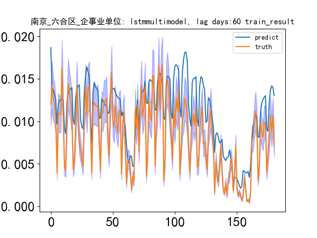

# NetworkFlowForecast
# 无线网业务预测

## 1. Data 

- predict label: future travel flow count

## 2. Data Preprocess

## 3. Model Structure
TorchLSTM(

(lstm): LSTM(17, 32, num_layers=2, batch_first=True)

(fc): Linear(in_features=160, out_features=1, bias=True)

(sigmoid): ReLU()

)

## 4. Result
Model evaluation index：rmse 510.74654912557213, mae 419.77051829028665, r2 0.999701529812395

